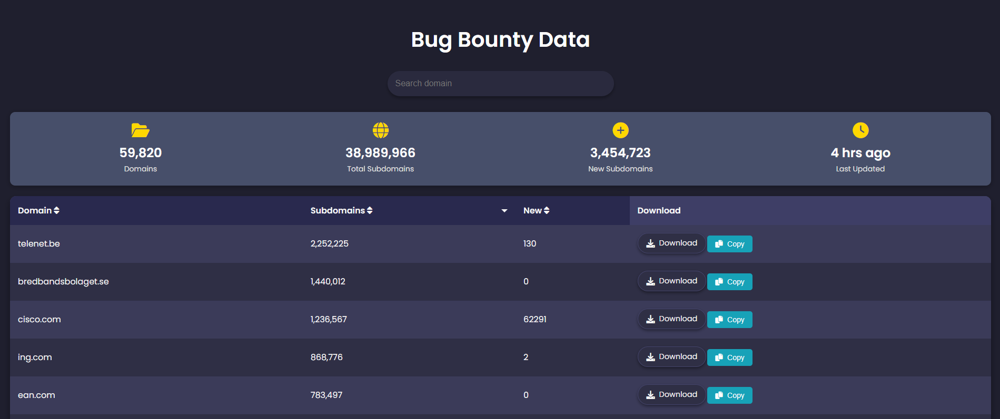

# Bug Bounty Subdomain Data

本目录汇集了大量公共漏洞赏金 (Bug Bounty) 和责任披露项目 (VDP) 的子域名列表，供安全研究人员在进行资产发现和渗透测试时参考。

## 🔍 数据说明
- **资产范围**: 涵盖了 84,000+ 个域名的子域名。
- **原始数据**: 位于 `data/` 目录下的 `.txt` 文件，每个文件对应一个主域名的已知子域名列表。
- **统计信息**: 详见 `metadata/` 目录中的 JSON 文件。

## 📋 使用指南

### 1. 数据过滤
由于子域名列表未经人工筛选，可能包含第三方服务或合作伙伴域名。建议配合 `grep` 进行精准过滤。

**过滤特定后缀:**
```bash
# 仅保留 *.dell.com 的资产
grep -a "\.dell.com$" data/dell.com.txt
```

### 2. 批量搜索
可以利用 `grep` 在整个数据集内搜索特定关键词：
```bash
grep -r "admin" data/
```

## 🌐 在线版
为了更好的交互体验，您可以访问：[bugbountydata.netlify.app](https://bugbountydata.netlify.app)
该网站提供直观的图形界面，方便搜索和查看最新的漏洞赏金项目动态。



---
> [!IMPORTANT]
> 请遵守各厂商的漏洞披露政策 (VDP)，未经许可的扫描行为可能违反当地法律。